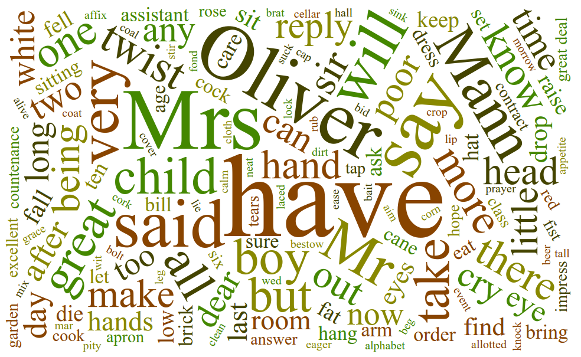

Easy Word Cloud using D3
========================

There is an amazing [D3](http://www.d3js.org/)
[wordcloud plugin](https://github.com/jasondavies/d3-cloud)
for creating beautiful wordclouds. But it's not trivial for everyone
to put it to use. This plugin makes it easy to create such a wordcloud.



Usage
-----

A simple html page with a wordcloud might contain:

```html
<html>
  <head>
    <title>Word Cloud</title>
    <script src="lib/d3/d3.js"></script>
    <script src="lib/d3/d3.layout.cloud.js"></script>
    <script src="d3.wordcloud.js"></script>
  </head>
  <body>
    <div id='wordcloud'></div>
    <script>
      d3.wordcloud()
        .size([800, 400])
        .selector('#wordcloud')
        .words([{text: 'word', size: 5}, {text: 'cloud', size: 15}])
        .start();
    </script>
  </body>
</html>
```

That's all! The following properties are accepted:
* `selector()` which css selector to create the wordcloud on
* `element()` an element instead of the previous selector
* `scale()` a d3 scale for sizing words, e.g. `sqrt`, `log` or `linear`
* `fill()` a d3 scale for coloring words, e.g. `d3.scale.category20b()`
* `transitionDuration()` how many milliseconds a resize transation takes

In addition to this, the following d3-cloud properties are accepted:
* `size()` dimensions [width, height]
* `words()` array of `{text: 'word', size: 1}` hashes
* `font()`
* `fontStyle()`
* `fontWeight()`
* `spiral()`, which can be `archimedean` or `rectangular`
* `padding()`

Extensions
* `onwordclick(function(d,i))` provide your own function to call when a word is clicked

```html
.onwordclick(function(d, i) {
  window.location = "https://www.google.co.uk/search?q=" + d.text;
})
```

Links
-----
* The original [d3-cloud](https://github.com/jasondavies/d3-cloud) plugin
* [d3-wordcloud](https://github.com/shprink/d3js-wordcloud), example of how to use d3-cloud that this plugin is based on
* [Article on using d3-cloud](https://weblogs.java.net/blog/manningpubs/archive/2014/11/10/d3-making-word-cloud-effective-graphical-object)
* Java-based [wordle.net](http://wordle.net), which has inspired the d3-cloud plugin
